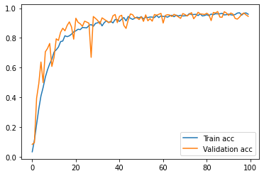
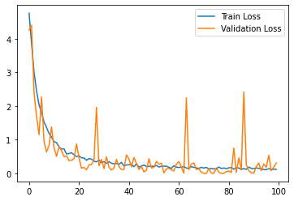

# FRUIT360-Fruit-VegetableClassification
Classification of Fruits and Vegetables using Convolutional Neural Networks (CNN) (Fruit 360 Dataset)
In this project, we want to classify given images according to 131 different classes using Convolutional Neural Networks. Steps are as follows:

 1. Data pre-process
 2. Data Generation - Train and Test
 3. Ceate CNN Model and Training
 4. Model Training and Get Evaluation Metrics
 5. Pedict new images with trained model
 
<div align="center">
  
  
</div>

## Introduction

* [FRUIT360 Dataset (Download Here)](https://www.kaggle.com/moltean/fruits) : This dataset was introduces with this paper: [Fruit Recognition from Images using Deep Learning](https://www.researchgate.net/publication/321475443_Fruit_recognition_from_images_using_deep_learning) . The aim of this paper is to propose a new dataset of images containing popular fruits. Total number of images is 90483 (train sample 67692 - test sample 22688). Notica that, 103 images consist more than one fruit class). Each images is RGB and has 100x100 resolution. In our project, we train with RGB images without converting gray-scale.

* [Keras](https://keras.io/getting_started/) : Keras is an open-source software library that provides a Python interface for artificial neural networks. Keras uses TensorFlow or Theano libraries as backend. Keras is a powerful and easy-to-use free open source library for developing and evaluating deep learning models. We utilizi lots of built-in functions.


## Requirements & Dependencies
* We build our algorithm using "Anaconda Environment" on Jupyter Notebook.
* Required packages and libraries are given as txt file (bio-enc.txt). You can directly create environment and activate like this:
  
  ```bash
  conda env create --file bio-env.txt
  conda activate env
  ```
 * If you want to install libraries manually, then fundamental packages as follows
 -----------------------------
| Library     |  Version      |
|-------------|-------------  |
|   Tensorflow    |   1.14.0         |
|   Keras         |   2.3.1          |
|   Pandas        |   1.1.3          |
|   Numpy         |   1.19.1         |
|   Matplotlib    |   3.3.1          |
-----------------------------

## Usage
* Download this repo and run "fruit360.ipynb" file jupyter notebook.
* Download dataset from above link and put the same file where your code is
* **Important Note:** In this dataset, each fruit class has own folder names. therefore, we use some special code which allow us each folder name as a class label. **flow_from_directory** is a function that used to generate train data and their labels.

  ```ruby
  train_generator = train_datagen.flow_from_directory(
        train_path, 
        target_size=x.shape[:2],
        batch_size = batch_size,
        color_mode= "rgb",
        class_mode= "categorical")
  ```

## Experiment Results
result of the experiments as shown below. Notice that, there are hyper-parameters (epoch and batch size, optimizer, loss function etc) that should be considered and all of them effect the success of model.

 

